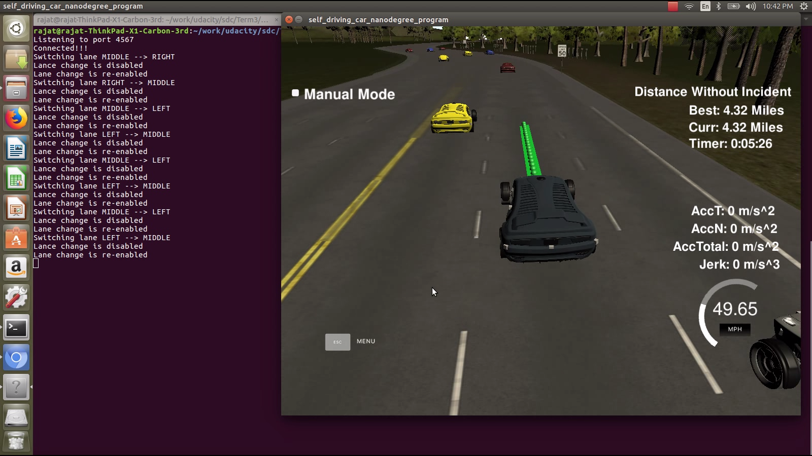
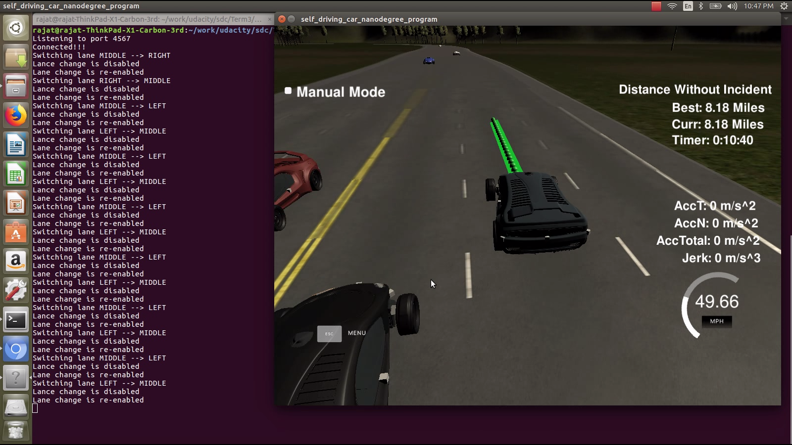

# Overview
This project implements a very simple approach to highway path planning with 3 lane highways. While it's not a very robust implementation, it could perform reasonably well to meet all the project Rubric points in below run which completed 4.32 Miles in 5:16 ...



... and total of 8.18 Miles in 10:40



And this is the video for complete run, hope you enjoy watching it:
[](https://www.youtube.com/watch?v=4CoLHeNxSKI)

This is no where a near perfect implementation and can occasionally violate driving constrains defined in Rubric points as other vehicles in simulator appear on road in different states with random probability and this simple model doesn't handle all possible scenarios where it can break. 

## Path Planner
I started out with simple path planner design as suggested in walkthrough videos and gradually enhanced with adding some simple constraints. Planner implements following set of rules.
1. Keep moving in current lane, speeding up all the way upto max speed limit.
2. If there is a car in front at a distance lower than `FRONT_GAP` threshold, try to change lane left or right.
3. Lane change is possible if target lane meets distance from front car is more than `FRONT_GAP_LC` and similarly distance from rear car is less than `REAR_GAP_LC`.
4. Lane change gap `FRONT_GAP_LC` > `FRONT_GAP`, this avoid changing lanes if next lane is only marginally and perhaps momemtarily better.
5. Changing lane from middle lane has two options to the left or right lane. Lane with farther distance to car in front is picked. In case of ties, left lane is chosen.
6. Car has preference to drive in middle lane as it is strategically the best lane where both lane change options are open. If current lane of the car (left or right) is fast enough and middle lane has no front car in horizon, planner makes an opportunistic lane change to middle lane.
7. Avoids frequent and abrupt lane changes by disabling lane change by raising `_lc_disable` from 0 to 1. On every future path planning invocation, this counter is incremented and it resets to 0 if counter reaches `LANE_CHANGE_RESET_CNT`, thereby re-enabling lane change.
8. Finally if lane change is not feasible, car starts to slow down.

## Prediction
As described in project walkthrough video, I have decided to consume previous_path returned by simulator and extend it further by predicting state of the cars at the end of the previous path i.e. at time `prev_sz * TIME_STEP`. For our car (call it Ego), I have assumed car speed as reported by simulator in s direction only, which is not accurate but this approximation works reasonably well. For other cars on the road, I have used dot product of `vx` and `vy` velocity component from `sensor_fusion` data with dx and dy values from closest way point to get velocity in `s` and `d` direction. Added following method:

```cplusplus
// Return velocity along s and d in frenet coordinates
vector<double> getFrenetVelocity(double x, double y, double vx, double vy,
        const vector<double> &maps_x, const vector<double> &maps_y,
        const vector<double> &maps_dx, const vector<double> &maps_dy)
{
    int wp = ClosestWaypoint(x, y, maps_x, maps_y);
    double dx = maps_dx[wp];
    double dy = maps_dy[wp];
    double vd = vx*dx + vy*dy;
    double vs = -vx*dy + vy*dx;
    return {vs, vd};
}
```

The predicted states of all the cars within a visible horizon bounded by `FRONT_HORIZON` and `REAR_HORIZON` are added to a `Prediction` class which maintains a map of every lane. This class comes in handy when planner enquires for distance to front and rear car in a particular lane at a particular s distance.

## Trajectory Generation
I used exact code for trajectory generation as described by Aron and David in project walkthrough video using spline library and waypoints extending the previous trajectory of the car.

## Code Structure
In adition to changes in `main.cc`, I have added following new files
`car.h`: Implements `Car` class to represent state of the car in frenet coordinates. It can be used to predict state of the car at time 't' in future.
`constants.h`: Defines various tunable parameters
`lane.h`: Implements the `Lane` class, a simple wrapper to access lane index and its next lane
`planner.h`: Defines the `Planner` class, responsible for path planning
`planner.cpp`: Implemets methods of `Planner` class, perhaps the most important file of this project
`prediction.h`: Defines the `Prediction` class, which maitains per lane map of predicted state of other cars on the road within a visible horizon.
`prediction.cpp`: Implements methods of prediction class, specially an interface to return front and rear vehicle in a given lane aorund given 's' distance.
`spline.h`: Spline library as suggested in project walkthrough and downloaded from [here](http://kluge.in-chemnitz.de/opensource/spline/)

# Future Scope
Overall it was one of the most ambitious project in this nanodegree program, I had both fun and frustating momemts doing this project. I started out with high hopes to incorporate everything that had been taught in the lessons, e.g. FSM for planner, JMT for trajectory generation. Cost functions to select best trajectory and normal distrbution to pertub multiple trajectories around the target. After days of coding effort, I could not make that approach work and I started to run out of time. Here is my [first attempt](https://github.com/rajatsharma01/CarND-Path-Planning-Project). Finally I decided to pivot back to simpler approach to finish this project on time. I started with walkthrough video implementation of the project and slowly started adding simple rules to the planner making sure everything works reasonably well for each small addition, something I should have done it from beginning of this project. Neverthless, I still hope to revisit this project after completion of this Nanodegree and try to incorporated all these ideas for a better path planning and trajectory generation.
